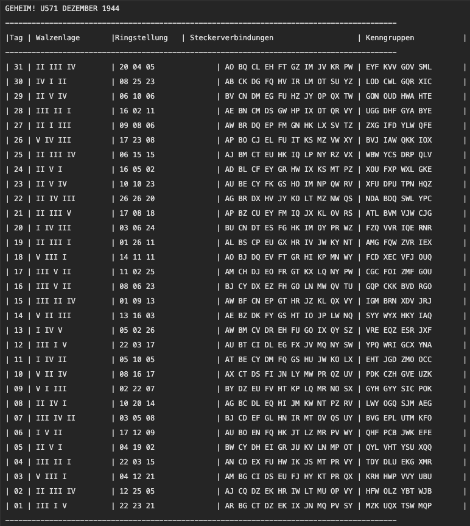
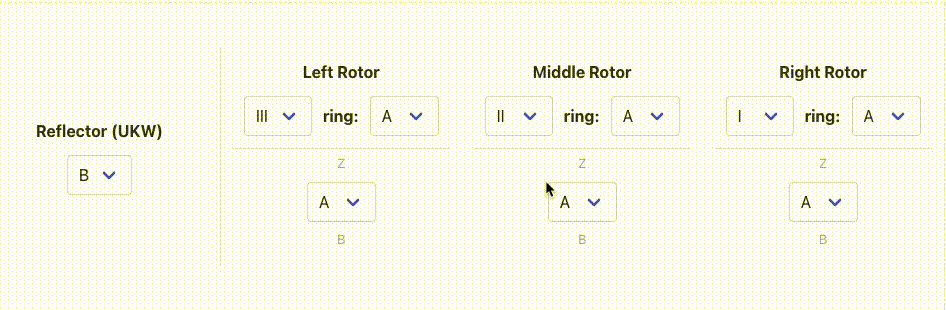
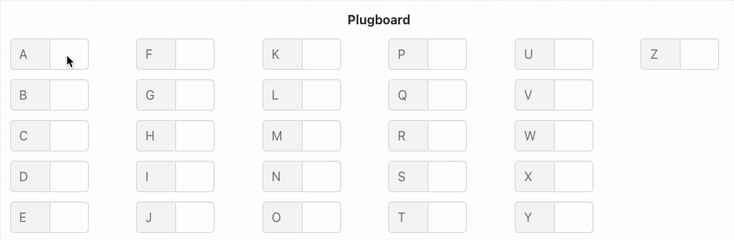
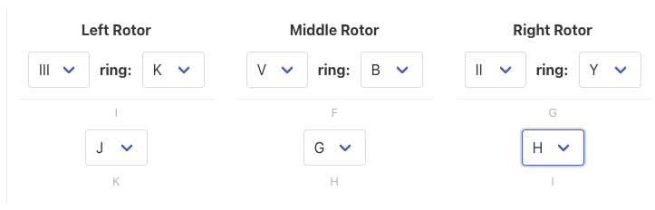
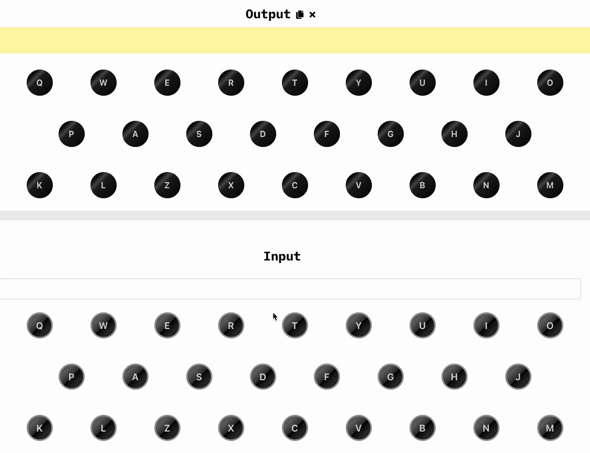
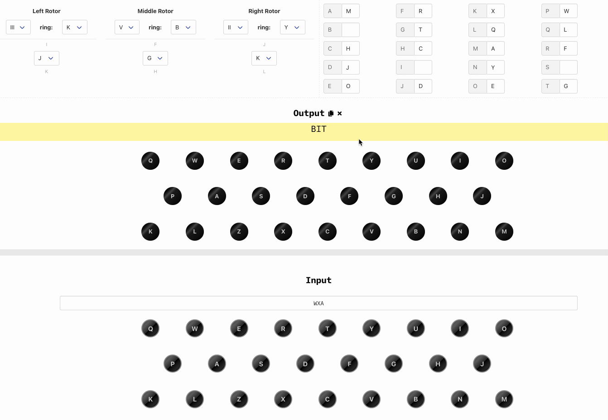
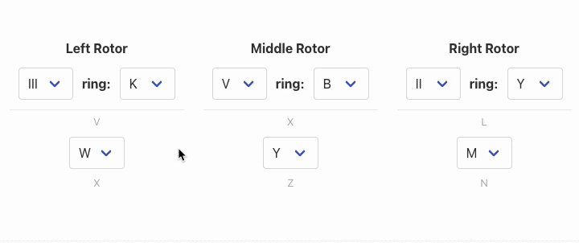
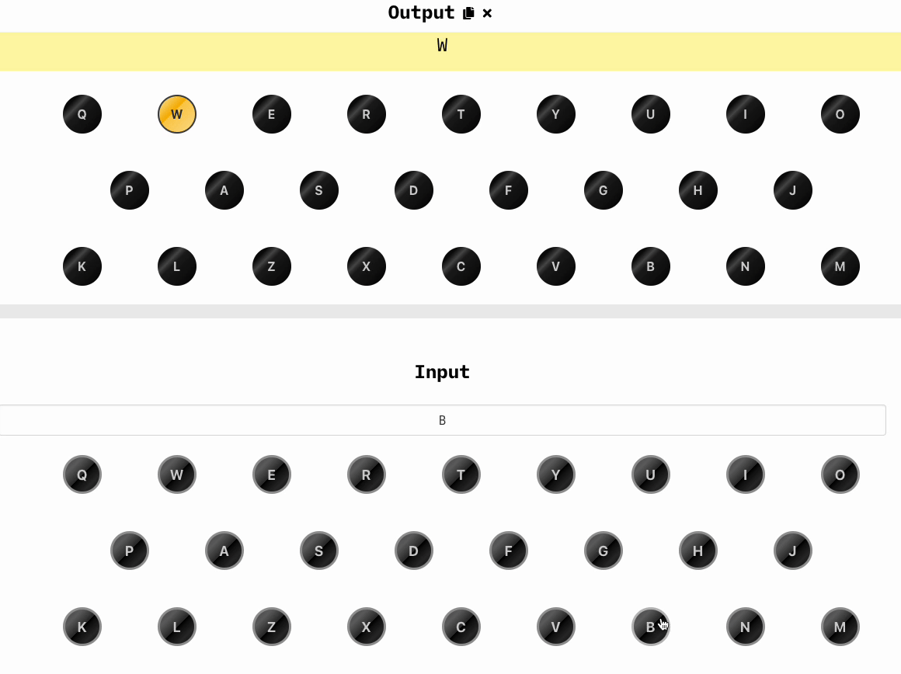

# Cryptographic Machine JS

🔗[Clique aqui para conferir](https://https://world-war-enigma.vercel.app/)

<!-- @import "[TOC]" {cmd="toc" depthFrom=1 depthTo=6 orderedList=false} -->

<!-- code_chunk_output -->

- [Enigma JS - O simulador Enigma I](#enigma-js-o-simulador-enigma-i)
  - [História](#históriahttpswwwcryptomuseumcomcryptoenigmahisthtm)
  - [Como usar](#como-usar)
    - [Conceitos](#conceitos)
    - [Livros de código](#livros-de-código)
    - [Criptografando uma mensagem](#criptografando-uma-mensagem)
      - [Configurando o cabeçalho](#configurando-o-cabeçalho)
    - [Descriptografando uma mensagem](#descriptografando-uma-mensagem)
  - [Leitura adicional](#leitura-adicional)
  - [Contribuição e Desenvolvimento](#contribuição-e-desenvolvimento)

<!-- /code_chunk_output -->


Consulte esta documentação em [English](README.md) | [Português](README.pt.md)


## Como usar

A Enigma pode ser usado para criptografar e descriptografar mensagens na mesma máquina. Mas antes que uma mensagem possa ser escrita, há alguns conceitos pelos quais você precisa passar primeiro.

### Conceitos

- **Roda de entrada (Eintrittswalze ou ETW)**: É o ponto de entrada do sinal para os rotores
- **Plugboard (Steckerbrett)**: É um conjunto de 13 pares de letras que serão trocadas entre si, o que significa que se um A estiver conectado a um B, uma vez que um A entrar, ele sairá como B. Você pode conectar uma chave ou não, se a chave não estiver conectada não haverá substituição.
- **Rotores**: Cada rotor é um disco circular como uma roda dentada com números (ou letras) de 1 a 26 ao seu redor. Por dentro, cada ponto de entrada é conectado a uma saída codificada diferente do outro lado. Há uma pequena janela na máquina onde você pode ver a posição atual do rotor.
- **Chave Diária (Grundstellung)**: É a posição inicial em que os rotores são colocados. Antes de 1940, esta era enviada junto com os livros de códigos para as configurações, após 1940, a chave diária era definida por mensagem.
- **Configuração do anel (Ringstellung)**: Cada rotor também vem com um mecanismo de deslocamento especial que permite girar o alfabeto, criando um deslocamento adicional na cifra. Essa configuração foi chamada de configuração do anel.
- **Refletor (Umkehrwalze ou UKW)**: É a etapa final da criptografia, ele conecta duas letras de forma fixa, e é o que permite que a mesma máquina seja usada para criptografar e descriptografar mensagens.

Mais informações sobre como o Enigma funciona podem ser encontradas:

- https://www.cryptomuseum.com/crypto/enigma/working.htm
- https://www.cryptomuseum.com/crypto/enigma/wiring.htm

### Livros de código

O exército enviava livros de códigos mensais para todos os soldados, esses livros de códigos tinham a configuração diária básica de uma máquina Enigma, todos os códigos eram reiniciados à meia-noite. Você pode conferir um exemplo deste livro de códigos [aqui](https://pastebin.com/pkJBjDEv).



- **Tag**: O dia
- **Walzenlage**: A seleção do rotor para o dia, a partirm do rotor mais à esquerda para o rotor mais à direita
- **Ringstellung**: Explicado acima
- **Steckerverbindungen**: Os pares do plugboard, a qualquer momento, apenas 10 pares seriam conectados
- **Kenngruppen**: O grupo de controle, utilizado para permitir que as mensagens produzidas em dias diferentes sejam lidas sem a necessidade de todas as configurações a todo momento.

### Criptografando uma mensagem

Vamos criptografar a seguinte mensagem: `ENIGMAISCOOL` que tem 12 caracteres.

Existem duas maneiras de criptografar uma mensagem usando o enigma (vamos usar somente a depois de 1940), mas ambas começam definindo as configurações corretas de acordo com o livro de códigos. Vamos exemplificar pegando o dia 17 de dezembro do livro de códigos acima e colocando-o no enigma.

Começamos com as configurações do rotor e do anel:



Nossos rotores são III, V, II. E as configurações do anel são 11 (K), 2 (B) e 25 (Y).

Agora, configuramos o plugboard:



#### Configurando o cabeçalho

Toda mensagem vinha com um cabeçalho, este cabeçalho tinha as seguintes informações:

```
horas = total de páginas = página atual = caracteres na mensagem = chave de configuração =
```

Antes de 1940, a chave era digitada duas vezes, pois a configuração já estava no livro de códigos. Para definir uma configuração válida, escolhemos aleatoriamente três letras, digamos `JGH` e definimos as posições do rotor para estas letras:



Agora escolhemos aleatoriamente outras três letras que serão nossa chave, digamos `WXA` e digitamos no teclado, obteremos um novo conjunto de três letras, que são `BIT`:



Esta é a chave que usaremos em nosso cabeçalho, que será:

```
1840 = 1tl = 1tl = 12 = JGH BIT =
```

Em seguida, escolhemos um dos grupos de três letras no Kenngruppen (no livro de códigos) para o nosso dia. Então vamos escolher `CGC` e duas outras letras aleatoriamente, como `OS` então `OSCGC`, este é o grupo de controle para nossa mensagem, é a primeira parte da mensagem que __não__ será criptografada:

```
1840 = 1tl = 1tl = 12 = JGH BIT =

OSCGC
```

O último passo é definir os rotores para nossa chave (`WXA`) e criptografar nossa mensagem:



A mensagem final será:

```
1840 = 1tl = 1tl = 12 = JGH BIT =

OSCGC CBNEK JAJIH ZX
```

A Enigma agrupou as letras em grupos de cinco letras, então é mais difícil entender a mensagem.

### Descriptografando uma mensagem

Então, agora que recebemos a mensagem acima, a primeira coisa é olhar para o primeiro grupo de cinco letras, ignoramos as duas primeiras letras e olhamos para o Kenngruppen para encontrar o dia em que a mensagem foi enviada, então configuramos a máquina de acordo.

Em seguida, colocamos a configuração inicial, que está no cabeçalho: `JGH`



Depois disso, digitamos a chave que foi enviada: `BIT` e devemos receber `WXA` de volta.



Agora definimos a chave como a posição do rotor e digitamos a mensagem sem o primeiro bloco:


Agora temos a mensagem final: `ENIGM AISCO OL` e só precisamos juntá-la: `ENIGMAISCOOL`

## Leitura adicional

Se você quiser continuar lendo, preparei [esta grande lista de links](https://lsantos.dev/yt-enigma-referencias) que você pode dar uma olhada.

O livro do professor David Kahn [The Codebreakers](https://www.amazon.com/Codebreakers-Comprehensive-History-Communication-Internet/dp/0684831309/ref=sr_1_1?keywords=the+codebreakers&qid=1669233736&sr=8-1) é uma ótima leitura se você quiser saber mais sobre o Enigma e as pessoas que o quebraram.

O professor [Mike Pound](https://github.com/mikepound) tem uma implementação super legal da mesma máquina em Java, você pode dar uma olhada [aqui](https://github.com/mikepound/enigma).

## Contribuição e Desenvolvimento

Para contribuir com o projeto, envie um PR. Este projeto é construído usando Vue.js + Vite e TypeScript. Todo o código é comentado para que as partes principais da lógica não sejam perdidas.

Para executar localmente, primeiro instale todos os pacotes com `npm install` e execute `npm run dev`, isso deve ativar um servidor vite local.


## Créditos

Gostaria de deixar meus agradecimento a Lucas Santos, com o qual aprendi bastante sobre este projeto, deixo abaixo seu blog:
- https://blog.lsantos.dev/